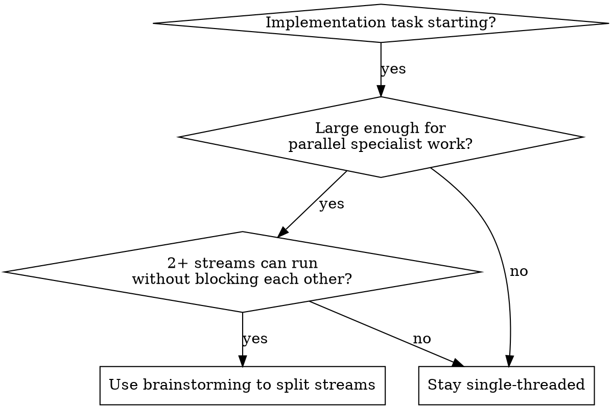

# God Mode

## Overview

Run substantial implementation work through a conductor agent that coordinates
specialist agents in tmux panes.

The conductor does not try to do all planning, design, investigation,
implementation, and review alone. It uses the strongest available agents for
each role, runs as much work in parallel as the task safely allows, and then
integrates the results into one coherent direction.

The agent that starts `god-mode` is the conductor. It owns the first planning
pass before spinning up specialists. Do not outsource initial decomposition too
early.

Treat the system as role-based first and vendor-based second:
- `conductor` (local): planning, decomposition, and synthesis
- `investigator`: exploration, repo investigation, and second-opinion analysis
- `designer`: UI, visual quality, and interaction critique
- `implementer`: exact file changes and tightly scoped execution
- `reviewer`: pure code-quality review on stable slices

Default routing tendencies when those CLIs are available:
- this session: conductor and first planning pass
- Claude: planning follow-up, exploration, and general investigation
- Gemini: UI design and critique
- Codex: implementation and pure code-quality review

These are defaults, not hard rules. If the user has a preferred role map,
follow it.

## When To Use

Use this skill when implementation is starting and the task is large enough that
parallel specialist input will likely improve speed or quality.

Strong signals:
- new feature or major behavior change
- product logic and UI/UX both matter
- multiple implementation streams can proceed independently
- there is enough scope that single-threaded execution would bottleneck progress

Do not use this skill for:
- tiny fixes or isolated one-file edits
- tasks where all streams depend on the same immediate shared context
- situations where tmux panes are unavailable and no fallback orchestration setup
  exists

## Core Principle

Delegate early. Keep tasks as small as possible. Parallelize aggressively where
streams are actually independent. Integrate decisively.

Do not wait until the conductor has fully analyzed everything before delegating.
Do enough grounding to route work well, then fan out.

Small tasks are easier to route, review, retry, and integrate. Favor slices that
produce one clear artifact, answer one clear question, or change one coherent
area.

## Setup Before First Run

Before using tmux orchestration in a new environment, do a short setup pass.
Act more like a provider detector than a guesser.

Minimum requirements:
- `tmux`
- `tmux-cli`
- the current conductor CLI
- at least one specialist CLI you can launch in another pane

Recommended specialist CLIs:
- `claude`
- `opencode`
- `codex`
- `gemini`

Check availability explicitly:

```bash
command -v tmux tmux-cli claude opencode codex gemini
```

Interpret the result like this:
- if `tmux` or `tmux-cli` is missing, stop and tell the user to install it
  before using `god-mode`
- if some specialist CLIs are missing, report which ones are available and route
  work using that subset
- if only one CLI is available, be explicit that cross-tool specialization is
  limited and consider staying single-threaded

Do not ask the user to infer the setup state. Show detected tools and what is
missing.

Then do a short setup handshake.

Preferred startup shape:

```text
God mode setup
- Detected: claude, codex, gemini
- Missing: opencode
- Conductor: this session

Recommended role map
- conductor/first planning pass: this session
- investigator: claude
- implementer: codex
- reviewer: codex
- designer: gemini
```

If the user has not already specified a role map, ask one focused follow-up:
- "Keep this map, or change any role assignments?"

If the user already gave a mapping, skip the question and reflect their choices
back in the setup summary.

Be responsive here. Keep the setup summary short, readable, and easy to edit.

## User Preference Input

Users should be able to define role preferences in plain language. Do not force
special syntax.

Good examples:
- "Keep this session as conductor. Use Claude for investigation, Codex for implementation
  and code review, and Gemini for UI."
- "Use OpenCode instead of Codex for implementation."
- "Use only Claude and Gemini."

Translate these into a role map, reflect the chosen map back to the user, and
then launch panes.

## Setup UX Rules

- keep the setup summary short enough to scan quickly
- show `Detected`, `Missing`, `Conductor`, and `Recommended role map`
- show `Actual role map` once overrides or fallbacks are applied
- show `Using <fallback> for <role>` when a preferred CLI is unavailable
- ask at most one setup question if the user has not already specified a map
- start dispatching as soon as the role map is clear

## Fallback Routing

Use stable fallback order when a preferred CLI is missing:

- `conductor/first planning pass`: current agent, then Claude, then OpenCode,
  then Codex, then Gemini
- `investigator`: Claude, then OpenCode, then Codex, then Gemini, then current
  agent
- `implementer`: Codex, then OpenCode, then Claude, then Gemini, then current
  agent
- `reviewer`: Codex, then Claude, then OpenCode, then Gemini, then current
  agent
- `designer`: Gemini, then Claude, then OpenCode, then Codex, then current
  agent

If a fallback is used, say so explicitly before dispatching work. Do not quietly
swap vendors and hope the user will not notice.

## Preconditions

Before dispatching work:
1. Run the setup check above and confirm `tmux` plus `tmux-cli` are available.
2. Record which specialist CLIs are installed locally.
3. Choose the role map: use the user's map if provided, otherwise use the
   recommended map plus fallbacks.
4. Confirm which panes you will launch for the chosen roles.
5. Confirm each target pane is alive enough to receive input, or launch it.
6. Identify the task slices that can run independently.

If the role map is not already known from conversation or project docs, ask one
focused question and then continue.

If a specialist pane does not exist yet, launch it. Do not assume the other
agents are already running.

## Start With A Local Plan

The conductor should usually do the first planning pass in the current pane.

Before launching other agents:
- identify the user outcome
- define the first workstreams
- decide which specialist roles are actually worth spinning up
- write the first small-task batch you want each specialist to tackle

This first plan does not need to be perfect. It just needs to be good enough to
launch the first parallel round with purpose.

## Kickoff With Brainstorming

Start by using `superpowers:brainstorming` to shape the work before dispatch.

Use it to answer four things quickly:
1. What is the actual user outcome?
2. Which roles are needed?
3. Which workstreams are independent enough to parallelize now?
4. What deliverable should come back from each role?

Then immediately shrink each workstream into the smallest useful next task. A
good first round is made of narrow slices, not broad open-ended assignments.

The output of this step should be a conductor-authored initial plan, not a vague
intention to ask the other agents what to do.

Do not turn brainstorming into a long design ceremony. Its purpose here is to
produce a clean parallelization plan.

## Quick Decision



If the answer is "stay single-threaded", say that explicitly and proceed.

## Conductor Workflow

### 1. Do a short grounding pass

Capture only what is needed to delegate well:
- user goal
- constraints and risks
- relevant repo or product context
- likely parallel workstreams

If a detail is only needed by one role later, do not block the whole system on
it now.

### 2. Split the task into parallel streams

Prefer workstreams over vague role chats.
Then break each stream into the smallest useful task that can complete without a
long dependency chain.

Good examples:
- `investigator`: requirements, acceptance criteria, sequencing, edge cases, repo
  exploration
- `designer`: UI critique, mobile behavior, hierarchy, copy adjustments
- `implementer`: exact file targets, implementation steps, focused code changes
- `reviewer`: pure code-quality review on stable slices

Better small-slice examples:
- `investigator`: define invite-state transitions only
- `designer`: critique the hero and form hierarchy only
- `implementer`: update the invite validation module only
- `reviewer`: inspect the validation slice for code quality only

For larger tasks, the conductor may split further, for example:
- logic stream
- UI stream
- implementation stream A
- implementation stream B

Only parallelize streams that are genuinely independent. If two streams will
fight over the same files or decisions, sequence them instead.

When in doubt, split smaller first. It is easier for the conductor to merge
three small results than unwind one oversized delegation.

### 3. Dispatch early and in parallel

After the first brainstorming pass, delegate all independent streams at once.

Do not hold back the designer because investigation has not finished every
detail.
Do not hold back the implementer if there is already a stable subproblem it can
 execute.

The default bias is parallel execution, not serial review queues.

Do not hand out large ambiguous assignments when a small concrete task would let
the specialist move immediately.

### 4. Launch specialist CLIs when needed

If a specialist agent is not already running in the target pane, start it first.

Preferred pattern:
1. `tmux-cli launch "zsh"` to create a durable shell pane
2. send the agent CLI launch command with its initial prompt
3. wait for idle, then capture output

Do this because launching the shell first preserves output if the agent command
fails.

Before launching, check which CLIs exist with shell commands such as:

```bash
command -v tmux tmux-cli claude gemini opencode codex
```

Use whichever specialist CLIs are available. Keep role ownership stable even if
the exact vendor mix changes.

Interactive launch examples with initial prompts:

```bash
# Claude Code: interactive session with initial prompt
claude "Explain this project and propose the first implementation slices."

# Gemini CLI: explicit interactive prompt mode
gemini -i "Review the UI and suggest the next smallest design tasks."

# OpenCode: start TUI and seed it with a prompt
opencode --prompt "Analyze this project structure and identify one safe code slice."

# Codex: interactive session with initial prompt
codex "Implement only the next smallest backend change from this plan."
```

Non-interactive subcommands like `opencode run`, `claude -p`, or `codex exec`
are useful for one-shot tasks, but `god-mode` should usually prefer interactive
specialist panes that can participate in multiple check-in rounds.

### 5. Use a consistent kickoff message

Use a compact prompt structure like this:

```text
Role: [investigator|designer|implementer|reviewer]
Workstream: [name]
Goal: [what the user needs]
Context:
- [relevant repo or product context]
- [constraints]
- [what other roles or streams are covering]

Deliverable:
- [exact output wanted from this role or stream]

Reply with:
1. recommendation or result
2. risks or blockers
3. next concrete actions
```

Make the deliverable specific enough that another agent can use it without a
long follow-up.

If the requested work feels broad, split it before sending. The conductor should
prefer short loops over oversized delegations.

### 6. Coordinate with tmux-cli deliberately

Use `tmux-cli send` for agent-to-agent prompts.
Use `tmux-cli wait_idle` before capturing output.
Use `tmux-cli capture` to read results.
Use `tmux-cli execute` only for shell commands where exit code matters, not for
chatting with another agent.

Typical pattern:

```bash
tmux-cli send "...prompt..." --pane=<role-pane>
tmux-cli wait_idle --pane=<role-pane> --idle-time=2.0 --timeout=120
tmux-cli capture --pane=<role-pane>
```

Avoid tight polling loops. Wait for idle, then capture.

If the pane already has the right agent running, send the next task instead of
restarting the CLI.

If the pane has a shell or the wrong agent, reset it deliberately before sending
new work.

### 7. Integrate in rounds

When outputs return:
- compare recommendations
- resolve contradictions centrally
- merge compatible outputs into a sharper direction
- immediately launch the next wave of parallel work if more independent tasks
  are now available

Think in orchestration rounds, not one giant delegation followed by one giant
summary.

Each round should end with a check-in through the conductor. Specialists do not
freelance indefinitely. They complete a small task, report back, and let the
conductor decide whether to continue, redirect, merge, or stop.

### 8. Keep implementation parallelized

Once the direction is stable enough, keep searching for independent
implementation slices.

Examples:
- one implementer stream updates backend logic
- another implementer stream updates UI components
- designer reviews the live direction in parallel
- investigator checks acceptance criteria and edge cases in parallel

If only one implementer pane exists, still keep investigation, design, or code
review running in parallel with implementation when those streams are useful.

Keep implementation slices small:
- one module
- one component
- one edge case
- one migration step
- one review pass

After each slice, check back in with the conductor before expanding scope.

### 9. Integrate and unblock

The conductor should:
- synthesize outputs into one decision
- unblock stuck streams with sharper prompts or extra context
- decide when to stop parallelizing and converge
- write code itself when needed to stitch pieces together or maintain momentum

Delegate-first does not mean delegate-only. The conductor owns the final shape.

The conductor also owns task sizing. If a specialist starts carrying too much
scope at once, shrink the next assignment.

## Role Guidance

### Investigator

Use for:
- business rules and edge cases
- acceptance criteria
- identifying dependencies that block safe parallelization
- repo exploration and second-opinion investigation

Ask for artifacts such as:
- concise implementation plan
- dependency map
- decision memo
- edge-case checklist

Do not outsource the first planning pass. The conductor should arrive with an
initial plan already in hand. If another pane is useful for deeper analysis,
use the `investigator` role rather than replacing the conductor.

Default bias when available: Claude.

### Designer

Use for:
- layout and hierarchy critique
- responsive and mobile behavior
- polish, clarity, and interaction quality
- UX review of work already being implemented

Ask for artifacts such as:
- concrete UI recommendations
- component-level critique
- copy and interaction adjustments
- design review notes on in-progress implementation

### Implementer

Use for:
- exact file-level changes
- tightly scoped coding tasks
- command execution
- turning the integrated direction into working code

Give the implementer the narrowest possible brief that still allows fast,
independent progress.

Prefer "change this file or function for this purpose" over "implement the
feature".

Default bias when available: Codex.

### Reviewer

Use for:
- pure code-quality review
- maintainability critique on stable slices
- checking whether a narrow implementation change is clean enough to expand

Ask for artifacts such as:
- short quality review notes
- risks, cleanup suggestions, and follow-up actions

Default bias when available: Codex.

## Parallelization Heuristics

Parallelize when:
- streams touch different files or layers
- one stream can define constraints while another executes a stable subproblem
- design review can happen while code is being written
- investigator can validate edge cases while implementation proceeds
- reviewer can inspect stable slices while implementation continues elsewhere

Prefer parallelizing many small safe slices over a few large risky slices.

Do not parallelize when:
- streams would edit the same area destructively
- a core product decision is still unresolved
- one stream's output completely determines another stream's starting point

## Guardrails

- Do not orchestrate tiny tasks just because multiple panes exist.
- Do not outsource the first planning pass if the current agent can do it.
- Do not send vague prompts like "look into this".
- Do not ask all roles the same open-ended question unless comparison itself is
  the goal.
- Do not serialize everything by habit; parallelize whenever independence is
  real.
- Do not give a specialist a huge chunk of work when it can be split into
  smaller check-in-sized tasks.
- Do not assume specialist panes already exist; launch them when needed.
- Do not let parallel streams drift without conductor synthesis.
- Do not treat vendor names as the core abstraction; use role ownership.
- Do not silently override a user-defined role map.
- If one pane is unavailable, redistribute the work and continue.

## Check-In Pattern

Use short loops:
1. conductor defines the next smallest useful tasks
2. specialists work in parallel
3. specialists report back
4. conductor evaluates the results
5. conductor decides the next small batch

The check-in is where quality, direction, and dependency management happen. Do
not skip it just because the specialist seems to be making progress.

## Pane Lifecycle

For each specialist role:
1. decide whether a pane already exists for that role
2. if not, launch a new shell pane with `tmux-cli launch "zsh"`
3. start the correct CLI in that pane with an initial prompt
4. keep reusing that pane across check-in rounds
5. restart only when the pane is broken, misassigned, or unrecoverable

Stable panes reduce repeated setup cost and preserve short-term context.

## User-Facing Output

When reporting progress, prefer this structure:

- `Setup`: detected tools, missing tools, chosen role map, fallbacks used
- `Delegation`: which streams and roles are running
- `Key decisions`: what came back and what you chose
- `Implementation`: what changed, what is in progress, and what is next
- `Risks`: unresolved issues or convergence points

Keep it concise. The value is in better execution, not in narrating every tmux
message.

## Example

For a new onboarding flow:
- do the first planning pass locally in the conductor pane
- show the detected-tool summary and recommended role map first
- use `brainstorming` to identify invite-state logic, mobile UI design, and repo
  implementation as parallel streams
- launch the needed specialist panes if they are not already running
- send `investigator` the invite-state rules only if a second planning or
  exploration pass will help
- send `designer` the mobile-first layout and copy critique only
- send `implementer` the first stable code slice immediately
- send `reviewer` a stable slice if you want a pure code-quality pass in parallel
- integrate the results, then launch the next round of small independent work

## Common Mistakes

**Mistake:** Doing too much solo analysis before delegating.

**Fix:** Ground quickly, then fan out.

**Mistake:** Waiting for one specialist to finish before involving the others.

**Fix:** Default to parallel streams as soon as the work can be cleanly split.

**Mistake:** Assuming the specialist agents are already open somewhere in tmux.

**Fix:** Explicitly launch the CLI you need in a shell pane, then seed it with
its initial prompt.

**Mistake:** Letting a specialist keep running on a large thread without an
orchestrator check-in.

**Fix:** Use short batches and reevaluate through the conductor after each one.

**Mistake:** Using orchestration as a substitute for making decisions.

**Fix:** The conductor owns synthesis, prioritization, and convergence.

**Mistake:** Hardcoding one vendor's strengths so the workflow breaks when the
tooling mix changes.

**Fix:** Keep roles stable and vendors swappable.

**Mistake:** Hiding the role map or silently choosing fallbacks.

**Fix:** Show detected tools, recommended assignments, and any fallback
substitutions up front in a short setup summary.
