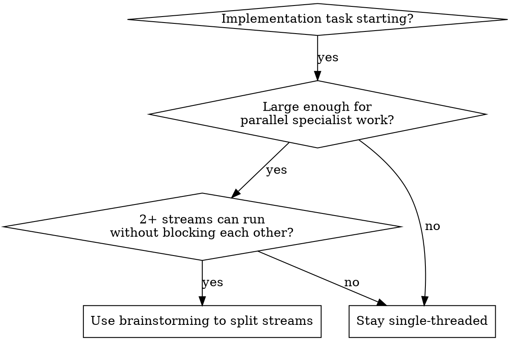

# Gaud Mode

## Overview

`gaud-mode` is the canonical name for this skill.

Treat these as user-facing aliases that should trigger the same skill:
- `gaud`
- `god-mode`
- `godmode`
- `god`

Run substantial implementation work through a conductor agent that coordinates
specialist agents in tmux panes and, when needed, across multiple tmux windows.

`gaud-mode` is not only a launcher. The conductor also:
- performs the first planning pass locally
- launches specialists with direct `B2V_DISABLED=true <cli>` prefixes
- supervises permission stalls and explicit callbacks
- keeps a registry of which panes and windows it created
- cleans up the panes and empty windows it spun up when the batch is done

The agent that starts `gaud-mode` is the conductor. It owns the first planning
pass before spinning up specialists. Do not outsource initial decomposition too
early.

Treat the system as role-based first and vendor-based second:
- `conductor`: planning, decomposition, synthesis, and cleanup
- `investigator`: exploration, repo investigation, and second-opinion analysis
- `designer`: UI, visual quality, and interaction critique
- `implementer`: exact file changes and tightly scoped execution
- `reviewer`: pure code-quality review on stable slices

Default routing tendencies when those CLIs are available:
- this session: conductor and first planning pass
- Claude: investigation and planning follow-up
- Gemini: UI design and critique
- Codex: implementation and pure code-quality review

These are defaults, not hard rules. If the user has a preferred role map,
follow it.

## When To Use

Use this skill when implementation is starting and the task is large enough that
parallel specialist input will likely improve speed or quality.

Strong signals:
- new feature or major behavior change
- product logic and UI both matter
- multiple implementation streams can proceed independently
- there is enough scope that single-threaded execution would bottleneck progress
- the user asks for `gaud-mode`, `gaud`, `god-mode`, `godmode`, or `god`

Do not use this skill for:
- tiny fixes or isolated one-file edits
- tasks where all streams depend on the same immediate shared context
- situations where tmux panes are unavailable and no fallback orchestration setup
  exists

## Core Principle

Delegate early. Keep tasks as small as possible. Parallelize aggressively where
streams are actually independent. Integrate decisively. Clean up after yourself.

Launch with the highest-autonomy safe mode available. Treat permission stalls,
completion signals, provider exhaustion, and pane cleanup as first-class
orchestration events, not as terminal noise.

Do not wait until the conductor has fully analyzed everything before delegating.
Do enough grounding to route work well, then fan out.

## Invocation Aliases

If the user says any of these, treat them as the same orchestration intent:
- `Use gaud-mode`
- `Use gaud`
- `Use god-mode`
- `Use godmode`
- `Use god`

If the user says `gaud-mode init`, `gaud init`, `god-mode init`, `godmode init`,
or `god init`, switch into setup mode before launching specialists.

## Setup Before First Run

Before using tmux orchestration in a new environment, do a short setup pass.
Act more like a provider detector than a guesser.

Minimum requirements:
- `tmux`
- `tmux-cli`
- the current conductor CLI
- at least one specialist CLI you can launch in another pane

Recommended specialist CLIs:
- `claude`
- `opencode`
- `codex`
- `gemini`

Check availability explicitly:

```bash
command -v tmux tmux-cli claude opencode codex gemini
```

Interpret the result like this:
- if `tmux` or `tmux-cli` is missing, stop and tell the user to install it
  before using `gaud-mode`
- if some specialist CLIs are missing, report which ones are available and route
  work using that subset
- if only one CLI is available, be explicit that cross-tool specialization is
  limited and consider staying single-threaded

Do not ask the user to infer the setup state. Show detected tools and what is
missing.

## Init Mode

Use plain-language setup through the skill itself. Do not require a separate
management CLI for this change set.

Canonical init requests:
- `Use gaud-mode init`
- `Use gaud init`

Accepted migration aliases:
- `Use god-mode init`
- `Use godmode init`
- `Use god init`

Persist preferences in JSONL files:
- global defaults: `~/.config/gaud.config.jsonl`
- repo overrides: `.gaud.config.jsonl`

Treat both files as append-friendly JSONL stores:
- read the last valid JSON object from each file
- merge repo override on top of global defaults
- if a file is missing, treat it as absent rather than an error

If `~/.config/gaud.config.jsonl` is missing on the first run, do one short
handshake before launching specialists:

```text
Gaud setup
- Detected: claude, codex, gemini
- Missing: opencode
- Global config: missing (`~/.config/gaud.config.jsonl`)
- Repo override: missing (`.gaud.config.jsonl`)

Recommended role map
- conductor/first planning pass: this session
- investigator: claude
- implementer: codex
- reviewer: codex
- designer: gemini

I can initialize gaud now, or use defaults for this run.
```

Ask one focused follow-up at most:
- `Initialize gaud now, or use defaults for this run?`

If the user chooses defaults for this run:
- continue without persisting
- say clearly that the defaults are temporary

If the user chooses init:
- reflect the chosen map back to the user
- persist the global defaults
- optionally persist repo overrides if they asked for repo-specific changes

## User Preference Input

Users should be able to define role preferences in plain language. Do not force
special syntax.

Good examples:
- `Keep this session as conductor. Use Claude for investigation, Codex for implementation and code review, and Gemini for UI.`
- `Use OpenCode instead of Codex for implementation in this repo.`
- `Use only Claude and Gemini.`
- `Use gaud, but keep repo overrides from .gaud.config.jsonl.`

Translate these into a role map, reflect the chosen map back to the user, and
then launch panes.

## Setup UX Rules

- keep the setup summary short enough to scan quickly
- show `Detected`, `Missing`, `Global config`, and `Repo override`
- show `Recommended role map`
- show `Merged default role map` when config exists
- show `Actual role map` once overrides or fallbacks are applied
- show `Using <fallback> for <role>` when a preferred CLI is unavailable
- ask at most one setup question if the user has not already specified a map
- if global config is missing, offer `init now` or `defaults for this run`
- start dispatching as soon as the role map is clear

## Fallback Routing

Use stable fallback order when a preferred CLI is missing or unavailable for the
current round:

- `conductor/first planning pass`: current agent, then Claude, then OpenCode,
  then Codex, then Gemini
- `investigator`: Claude, then OpenCode, then Codex, then Gemini, then current
  agent
- `implementer`: Codex, then OpenCode, then Claude, then Gemini, then current
  agent
- `reviewer`: Codex, then Claude, then OpenCode, then Gemini, then current
  agent
- `designer`: Gemini, then Claude, then OpenCode, then Codex, then current
  agent

If a fallback is used, say so explicitly before dispatching work. Do not quietly
swap vendors and hope the user will not notice.

## Provider Health Preflight

Before launching a substantial multi-role batch, check provider health for the
roles you are about to launch.

Use these statuses:
- `ready`
- `quota-blocked`
- `rate-limited`
- `auth-blocked`
- `unknown`

Keep probing light and bounded:
- prefer a small provider-specific status check if you know one
- otherwise launch and classify the first failure if needed
- cache the result for the current orchestration round
- do not stall the workflow trying to normalize every CLI's status UX

Use the statuses like this:
- `ready`: launch normally
- `quota-blocked`, `rate-limited`, `auth-blocked`: reroute before dispatch and
  announce the fallback
- `unknown`: continue if needed, but say the status is unknown instead of
  claiming health you did not verify

If a provider looked healthy but fails at launch with a usage or quota error,
reclassify it as unavailable for the current round and reroute immediately.

## Preconditions

Before dispatching work:
1. run the setup check above and confirm `tmux` plus `tmux-cli` are available
2. load `~/.config/gaud.config.jsonl` and `.gaud.config.jsonl` if they exist
3. choose the role map: user override, else repo override, else global default,
   else recommended map plus fallbacks
4. identify the task slices that can run independently
5. record the conductor pane identifier in `session:window.pane` form
6. build or refresh a role registry that tracks pane identity and whether a pane
   or window was created by `gaud-mode`
7. confirm each target pane is alive enough to receive input, or launch it

If the role map is not already known from conversation or config, ask one
focused question and then continue.

## Window And Pane Layout Model

Treat tmux windows as capacity buckets.

Layout rules:
- keep at most three total panes in one tmux window
- the conductor pane counts toward that limit when it lives in the window
- before creating a new tmux window, first reuse an existing gaud-managed window
  with spare capacity
- when a fourth pane would make the current window cluttered, use another tmux
  window and track it explicitly

Maintain a registry like this:

```text
role=implementer pane=dev:2.1 window=dev:2 created_by_gaud=true cli=codex state=working
```

Track at least:
- `role`
- `session:window.pane`
- `session:window`
- `created_by_gaud`
- `cli`
- `state`

Stable panes reduce repeated setup cost and preserve short-term context. Stable
windows reduce visual clutter.

## Pane State Model

Treat each specialist pane as exactly one state at a time:

| State | Meaning | Conductor action |
| --- | --- | --- |
| `working` | The specialist is actively thinking, editing, or running commands. | Leave it alone and re-check after the next `wait_idle`. |
| `waiting-permission` | The pane stopped on a safe execution approval such as `run this command` or `press enter to continue`. | Auto-proceed once, then `wait_idle` and `capture` again. |
| `waiting-user` | The pane is blocked on a risky or product-shaping choice such as deploy, billing, secrets, auth, destructive git/file actions, production data, or unresolved scope. | Stop auto-proceeding and surface the choice to the user. |
| `done` | The specialist finished a batch and reported back, ideally with an explicit callback. | Capture the result, integrate it, and assign the next small task or clean up. |

Silence is not a state. After `tmux-cli wait_idle`, always classify the pane by
capturing output or by handling an explicit callback from the specialist.

Prefer `GAUDMODE` for callbacks. During migration, accept legacy `GODMODE`
callbacks too.

## Start With A Local Plan

The conductor should usually do the first planning pass in the current pane.

Before launching other agents:
- identify the user outcome
- define the first workstreams
- decide which specialist roles are actually worth spinning up
- write the first small-task batch you want each specialist to tackle

This first plan does not need to be perfect. It just needs to be good enough to
launch the first parallel round with purpose.

## Kickoff With Brainstorming

Start by using `superpowers:brainstorming` to shape the work before dispatch.

Use it to answer four things quickly:
1. What is the actual user outcome?
2. Which roles are needed?
3. Which workstreams are independent enough to parallelize now?
4. What deliverable should come back from each role?

Then immediately shrink each workstream into the smallest useful next task. A
good first round is made of narrow slices, not broad open-ended assignments.

## Quick Decision



If the answer is `stay single-threaded`, say that explicitly and proceed.

## Conductor Workflow

### 1. Do a short grounding pass

Capture only what is needed to delegate well:
- user goal
- constraints and risks
- relevant repo or product context
- likely parallel workstreams

### 2. Split the task into parallel streams

Prefer workstreams over vague role chats.
Then break each stream into the smallest useful task that can complete without a
long dependency chain.

Good examples:
- `investigator`: requirements, acceptance criteria, sequencing, edge cases,
  repo exploration
- `designer`: UI critique, mobile behavior, hierarchy, copy adjustments
- `implementer`: exact file targets, implementation steps, focused code changes
- `reviewer`: pure code-quality review on stable slices

Only parallelize streams that are genuinely independent. If two streams will
fight over the same files or decisions, sequence them instead.

### 3. Dispatch early and in parallel

After the first brainstorming pass, delegate all independent streams at once.

Do not hold back the designer because investigation has not finished every
detail.
Do not hold back the implementer if there is already a stable subproblem it can
execute.

### 4. Launch specialist CLIs when needed

If a specialist agent is not already running in the target pane, start it first.

Preferred pattern:
1. choose a target window using the layout rules above
2. create a durable shell pane if needed with `tmux-cli launch "zsh"`
3. start the specialist CLI with a direct `B2V_DISABLED=true <cli>` prefix in
   the highest-autonomy safe mode it supports
4. seed the kickoff prompt at process start whenever the CLI supports a startup
   prompt
5. use `tmux-cli send` for later rounds, then wait for idle, capture output, and
   classify the pane state

Before launching, check which CLIs exist with shell commands such as:

```bash
command -v tmux tmux-cli claude gemini opencode codex
```

Preferred autonomy flags when supported:
- `B2V_DISABLED=true claude --dangerously-skip-permissions "<kickoff prompt>"`
- `B2V_DISABLED=true codex --yolo "<kickoff prompt>"`
- `B2V_DISABLED=true gemini --yolo -i "<kickoff prompt>"`
- `B2V_DISABLED=true opencode --prompt "<kickoff prompt>"`

Treat the direct `B2V_DISABLED=true <cli>` prefix as required for every
specialist launch path, not just an example.

If a CLI supports a startup prompt or initial prompt flag, put the first kickoff
message in the launch command instead of launching empty and sending the prompt
afterward.

If a prompt is only about an optional update or non-essential setup step, skip
it and continue.

If the update appears required for the assigned task, or you are not sure
whether skipping is safe, escalate instead of guessing.

Do not bypass approvals automatically for deploys, billing changes, credential
access, auth changes, destructive git/file actions, production data operations,
or other irreversible actions unless the user explicitly asked for that level of
autonomy.

Interactive launch examples with startup prompt seeding:

```bash
# Claude Code: seed the startup prompt on launch
B2V_DISABLED=true claude --dangerously-skip-permissions "Explain this project and propose the first implementation slices."

# Gemini CLI: explicit interactive prompt mode
B2V_DISABLED=true gemini --yolo -i "Review the UI and suggest the next smallest design tasks."

# OpenCode: start TUI and seed it with a startup prompt
B2V_DISABLED=true opencode --prompt "Analyze this project structure and identify one safe code slice."

# Codex: seed the startup prompt on launch
B2V_DISABLED=true codex --yolo "Implement only the next smallest backend change from this plan."
```

### 5. Use a consistent kickoff message

Use a compact prompt structure like this:

```text
Role: [investigator|designer|implementer|reviewer]
Workstream: [name]
Goal: [what the user needs]
Coordinator pane: [session:window.pane]
Context:
- [relevant repo or product context]
- [constraints]
- [what other roles or streams are covering]

Autonomy policy:
- Continue through safe repo exploration, file reads, code edits, and local verification needed for this batch.
- Skip optional update prompts, release notes, telemetry notices, and other non-essential setup screens when they are not required.
- If you are unsure what to do next, stop guessing and ask through the conductor.

If an update or setup interruption appears required for the assigned task, or you are not sure whether skipping is safe, escalate instead of guessing.

If you are confused about the requested outcome, do not invent the missing requirement. Ask one targeted question through the conductor.

If you are confused or the request is ambiguous, send:
- `tmux-cli send "GAUDMODE waiting-user role=[role] workstream=[name] summary=[targeted question]" --pane=[conductor-pane]`

If you hit a clearly safe execution approval, send:
- `tmux-cli send "GAUDMODE waiting-permission role=[role] workstream=[name] summary=[short reason]" --pane=[conductor-pane]`

If you hit a risky or ambiguous approval, send:
- `tmux-cli send "GAUDMODE waiting-user role=[role] workstream=[name] summary=[short reason]" --pane=[conductor-pane]`

When you finish this batch, send:
- `tmux-cli send "GAUDMODE done role=[role] workstream=[name] summary=[one-line result]" --pane=[conductor-pane]`
```

### 6. Coordinate with tmux-cli deliberately

Use `tmux-cli send` for agent-to-agent prompts.
Use `tmux-cli wait_idle` before capturing output.
Use `tmux-cli capture` to read results.
Use `tmux-cli execute` only for shell commands where exit code matters, not for
chatting with another agent.

Typical pattern:

```bash
tmux-cli send "...prompt..." --pane=<role-pane>
tmux-cli wait_idle --pane=<role-pane> --idle-time=2.0 --timeout=120
tmux-cli capture --pane=<role-pane>
```

Accept `GODMODE ...` callbacks too if a long-lived pane still uses the legacy
prefix.

### 7. Run a permission watchdog

After each `wait_idle`, classify the latest pane output before deciding the next
move.

Look for these patterns:
- `working`: the agent is still reasoning, editing, or actively streaming output
- `waiting-permission`: approval UI, `Run command?`, `[y/N]`, `Press Enter to continue`, or a safe execution menu
- `waiting-user`: scope questions or risky approvals involving deploys, secrets, billing, auth, destructive operations, or unrelated network access
- `done`: a clear completion summary or an explicit `GAUDMODE done ...` callback

For a clearly safe execution approval, auto-proceed once and then re-check:

```bash
tmux-cli send "Down" --pane=<role-pane> --enter=False
tmux-cli send "" --pane=<role-pane>
tmux-cli wait_idle --pane=<role-pane> --idle-time=2.0 --timeout=120
tmux-cli capture --pane=<role-pane>
```

### 8. Integrate in rounds

When outputs return:
- compare recommendations
- resolve contradictions centrally
- merge compatible outputs into a sharper direction
- immediately launch the next wave of parallel work if more independent tasks
  are now available

### 9. Clean up gaud-created panes and windows

When the batch is complete, the user cancels, or the system converges back to a
single pane, clean up the tmux resources that `gaud-mode` created.

Cleanup rules:
- track which panes and windows were created by `gaud-mode`
- prefer graceful exit first for active specialist CLIs
- close gaud-created specialist panes when they are no longer needed
- if a gaud-created window becomes empty, close that window too
- never kill the conductor pane unless the user explicitly asks
- never kill unrelated pre-existing panes or windows that `gaud-mode` did not
  create

## Role Guidance

### Investigator

Use for business rules, acceptance criteria, dependency discovery, and repo
exploration.

Default bias when available: Claude.

### Designer

Use for layout, mobile behavior, polish, clarity, and interaction quality.

### Implementer

Use for exact file-level changes, tightly scoped coding tasks, command
execution, and turning the integrated direction into working code.

Default bias when available: Codex.

### Reviewer

Use for pure code-quality review and maintainability critique on stable slices.

Default bias when available: Codex.

## Parallelization Heuristics

Parallelize when:
- streams touch different files or layers
- one stream can define constraints while another executes a stable subproblem
- design review can happen while code is being written
- investigator can validate edge cases while implementation proceeds
- reviewer can inspect stable slices while implementation continues elsewhere

Prefer parallelizing many small safe slices over a few large risky slices.

Do not parallelize when:
- streams would edit the same area destructively
- a core product decision is still unresolved
- one stream's output completely determines another stream's starting point

## Guardrails

- Do not orchestrate tiny tasks just because multiple panes exist.
- Do not outsource the first planning pass if the current agent can do it.
- Do not silently override a user-defined role map.
- Do not assume a quiet pane is done without a fresh capture or explicit
  callback.
- Do not use the old `env` wrapper form. Use direct prefixes like
  `B2V_DISABLED=true claude ...`.
- Do not let more than three total panes accumulate in one tmux window.
- Do not forget to clean up the panes and empty windows that `gaud-mode`
  created.
- Do not auto-approve prompts about deploys, billing, credentials, auth,
  destructive git/file actions, production data, or unrelated network scope.

## Check-In Pattern

Use short loops:
1. conductor defines the next smallest useful tasks
2. specialists work in parallel
3. specialists send `GAUDMODE waiting-permission`, `GAUDMODE waiting-user`, or
   `GAUDMODE done` callbacks when needed; otherwise the conductor uses
   `wait_idle` plus `capture`
4. conductor evaluates the results
5. conductor decides the next small batch or starts cleanup

## Quick Reference

| Situation | What to do |
| --- | --- |
| User says `gaud`, `god`, `godmode`, or `god-mode` | Treat it as a request for the canonical `gaud-mode` skill. |
| First run and no global config exists | Offer `gaud-mode init` or defaults for this run, using `~/.config/gaud.config.jsonl`. |
| Repo override exists | Load `.gaud.config.jsonl` after the global config and let the repo override win. |
| CLI supports startup prompt plus yolo or auto-proceed | Launch it with a direct `B2V_DISABLED=true <cli>` prefix in its highest-autonomy safe mode and seed the kickoff prompt at process start. |
| CLI has no yolo mode | Still launch it with a direct `B2V_DISABLED=true <cli>` prefix and handle permission stalls yourself. |
| Current window already has three panes | Reuse another window with capacity or create a new tmux window and track it. |
| Provider is `quota-blocked`, `rate-limited`, or `auth-blocked` | Reroute before dispatch and announce the fallback. |
| Provider status is `unknown` | Continue if needed, but say the status is unknown. |
| Safe execution approval prompt | Move the selection with `Up` or `Down` if needed, send Enter once, then capture again. |
| Optional update or non-essential setup prompt | Skip it when it is not required for the task. |
| Work is complete | Clean up gaud-created specialist panes and any now-empty gaud-created windows. |

## Rationalizations To Reject

| Excuse | Reality |
| --- | --- |
| `I launched with --yolo, so I do not need to monitor the pane.` | Some CLIs still pause, and some panes may not support yolo at all. Supervision still matters. |
| `The old env wrapper form is basically the same.` | Use the direct `B2V_DISABLED=true <cli>` prefix the user asked for. |
| `The provider is installed, so it is available.` | Installed does not mean ready. Quota, rate, or auth may still block the round. |
| `The task is over, but leaving the panes open is harmless.` | Gaud-mode should clean up the panes and empty windows it created unless the user asked to keep them. |

## Red Flags - Stop And Reclassify

- `wait_idle` returned but you have not captured the pane yet
- the same approval screen appears twice after one auto-proceed attempt
- the specialist sounds confused and is starting to guess at the requirement
- you are about to open a fourth pane in the same tmux window
- the run is over and you have not cleaned up gaud-created panes yet

## User-Facing Output

When reporting progress, prefer this structure:
- `Setup`: detected tools, config status, chosen role map, fallbacks used
- `Layout`: which roles live in which tmux windows and panes
- `Delegation`: which streams and roles are running
- `Queues`: which panes are `waiting-permission`, `waiting-user`, or `done`
- `Cleanup`: which gaud-created panes or windows were closed
- `Risks`: unresolved issues or convergence points

## Example

For a new onboarding flow:
- do the first planning pass locally in the conductor pane
- if `~/.config/gaud.config.jsonl` is missing, offer `init now` or `defaults for
  this run`
- show the detected-tool summary, config status, and recommended role map first
- use `brainstorming` to identify invite-state logic, mobile UI design, and repo
  implementation as parallel streams
- prefer startup prompt seeding with `B2V_DISABLED=true codex --yolo`,
  `B2V_DISABLED=true claude --dangerously-skip-permissions`,
  `B2V_DISABLED=true gemini --yolo -i`, or
  `B2V_DISABLED=true opencode --prompt`
- if the current tmux window already has three panes, use another window and
  track the new `session:window.pane` IDs
- if a provider is quota-blocked, reroute before dispatch and say so
- if a specialist is confused, have it send one targeted `GAUDMODE
  waiting-user` question instead of guessing
- when the batch is done, clean up the specialist panes and empty windows that
  gaud created

## Common Mistakes

**Mistake:** Launching specialists with the old `env` wrapper form because it
looks familiar.

**Fix:** Use direct prefixes like `B2V_DISABLED=true claude ...` on every
specialist launch path.

**Mistake:** Letting more than three panes pile up in the same tmux window.

**Fix:** Reuse another window with capacity or create a new tmux window before
the layout gets cluttered.

**Mistake:** Treating missing global config as a silent problem.

**Fix:** Offer `gaud-mode init` or defaults for the current run the first time.

**Mistake:** Assuming an installed provider is healthy enough to launch.

**Fix:** Run a light provider-health preflight for large batches and reroute when
the provider is clearly unavailable.

**Mistake:** Leaving gaud-created panes behind after the work is done.

**Fix:** Track created panes and windows from the start and clean them up at the
end unless the user explicitly asked to keep them open.
